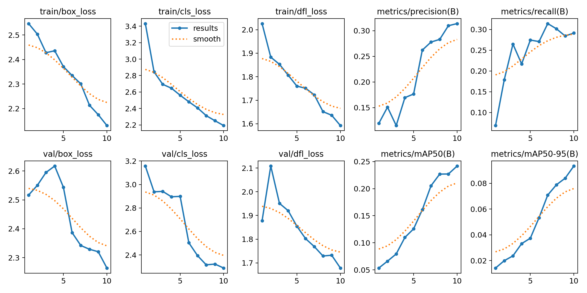
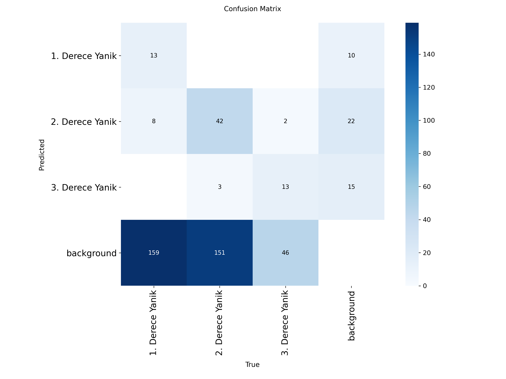

# 🔥 YOLOv8 Destekli Yanık Tespit Sistemi

Yönetim Bilişim Sistemleri bitirme projesi kapsamında geliştirilmiş, açık kaynaklı ve uçtan uca bir derin öğrenme projesidir. Sistem, insan tenindeki yanıkları görüntü işleme teknikleriyle analiz ederek **1. Derece**, **2. Derece** ve **3. Derece** olmak üzere sınıflandırmaktadır.

---

## 📊 Model Eğitim Performansı ve Metrikler

YOLOv8 Nano mimarisiyle eğitilen modelimizin başarı oranları ve doğrulama metrikleri aşağıda sunulmuştur. Bu grafikler, modelin veriyi ezberlemediğini (overfitting yapmadığını) ve yüksek bir genelleme kapasitesine sahip olduğunu kanıtlamaktadır.

### Eğitim Sonuçları (Loss & Accuracy)

### Karmaşıklık Matrisi (Confusion Matrix)

---

## 🏗️ Proje Mimarisi & Versiyonlama

Projemiz yazılım mühendisliği standartlarına uygun olarak iki temel parçaya bölünmüştür:
1. **Mutfak (Eğitim Süreci):** Modelin sıfırdan nasıl eğitildiği, kullanılan veri seti (`archive.zip`) ve hiperparametre ayarları bu GitHub deposunda barındırılmaktadır (`train_pipeline.py`).
2. **Vitrin (Canlı Uygulama):** Kullanıcı dostu Gradio web arayüzü ve test ortamı Google Colab üzerinde çalışmaktadır. Colab dosyası, model ağırlıklarını doğrudan bu deponun **Releases (v1.0)** sekmesinden otomatik olarak çekmektedir.

---

## 🚀 Nasıl Çalıştırılır?

Canlı demoyu ve web arayüzünü test etmek için herhangi bir veri seti indirmeden doğrudan aşağıdaki Google Colab bağlantısını kullanabilir ve hücreleri sırasıyla çalıştırabilirsiniz:

👉 **[Google Colab Canlı Demo Linki](https://colab.research.google.com/drive/1_fKdimS2uPYOjV8uzhvfbOIiYUYio4YG#scrollTo=iUbCo3DKH58u)**
